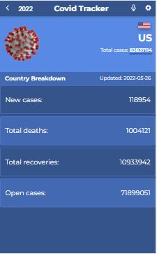

# Covid-19 Tracking App

> A Single Page Application that allows users to track the novel coronavirus.
> Users can search for country and click on a country to view their current data of covid stat.
> User will have access to following data: new cases, total deaths, total recovery, open cases and total cases.

## Screenshot

## Built With

- ReactJS
- Redux
- CSS/SCSS
- [Narrativa API](https://covid19tracking.narrativa.com/index_en.html)

## Live site 🚀

🔗 [Netlify](https://covidtracker9.netlify.app/)

## Getting Started

### Setup

To get a local copy up and running follow this simple step:

- Clone repository to your local machine:

`git@github.com:Ol-create/react-capstone-project.git`
This will create a directory in the name of the project folder.

### Install

- `cd react-capstone-project`
- Run `npm install` to install dependencies

### Usage

- Run `npm start` to start app
You should see the app in your browser address bar at `http://localhost:3000`

### Run tests
- Run `npm test` to launch the test runner in an interactive watch mode.
See the section about [running tests](https://facebook.github.io/create-react-app/docs/running-tests) for more information.

## Author

👤 **Oluyemi Paul**

- [GitHub: Ol-create](https://github.com/Ol-create)
- [Twitter: OluyemiPaul99](https://twitter.com/OluyemiPaul99)
- [LinkedIn: paul-oluyemi-193966ab](https://www.linkedin.com/in/paul-oluyemi)

## 🤝 Contributing

Contributions, issues, and feature requests are welcome!

Feel free to check the [issues page](../../issues/).

## Show your support

Give a ⭐️ if you like this project!

## Acknowledgments

- Covid-19 Data provided by [Narrativa technology](https://covid19tracking.narrativa.com/index_en.html)

- Original design idea by [Nelson Sakwa on Behance](https://www.behance.net/sakwadesignstudio).

## 📝 License

This project is [MIT](./LICENSE) licensed.
